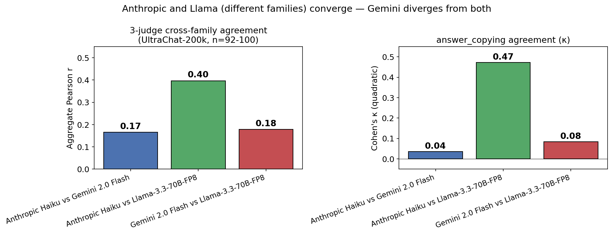
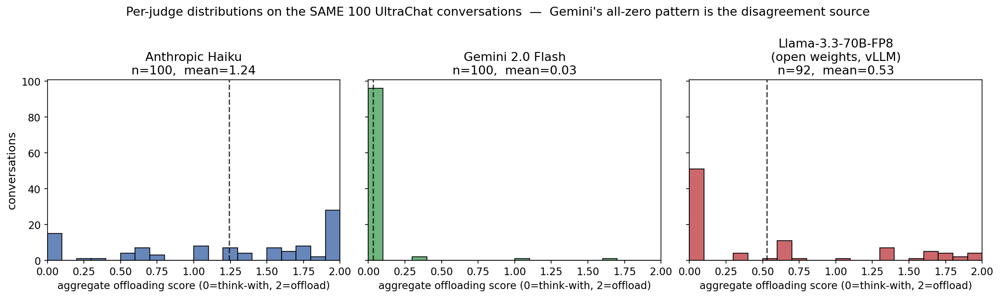
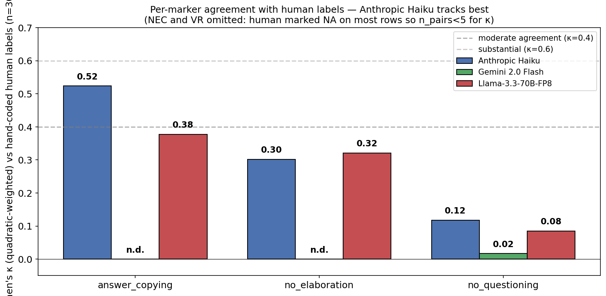

# Cognitive Offloading Detector

> v0.1 prototype. Exploratory work in progress.

A small LLM-as-judge that scores user turns in human-LLM conversations on five candidate behavioral markers related to cognitive offloading: **answer-copying, no-elaboration, no-error-correction, no-questioning, verbatim-reuse**. Intended as a starting point for behavioral analysis of dialogue, not a settled measurement instrument.

## Headline findings (v0.1)

Run on three datasets with multiple cross-family judges (full numbers in `results/`):

| Dataset | n | Judges | Aggregate Pearson r between judges |
|---|---:|---|---|
| Hand-crafted contrastive synthetic | 8 | Anthropic Haiku × OpenAI gpt-4o-mini × Gemini 2.0 Flash | **0.93–0.96** (all pairs) |
| WildChat-1M (open chat, GPT-generated) | 100 | Anthropic × Gemini | 0.26 |
| UltraChat-200k (GPT-generated) | 92–100 | Anthropic × Gemini × **Llama-3.3-70B-FP8** (self-hosted on Lambda H100 via vLLM) | Anthropic↔Llama **0.40** (κ=0.47 on answer_copying); Gemini↔both 0.17–0.18 |

### 3-judge agreement on UltraChat (the key methodological result)



Anthropic Haiku and Llama-3.3-70B-FP8 (different families, different training pipelines) converge moderately (r=0.40, κ=0.47 on answer_copying). Gemini 2.0 Flash diverges from both (r=0.17–0.18). The Anthropic-vs-Gemini disagreement is therefore better explained by **judge calibration drift** than by genuine rubric ambiguity.

### What that calibration drift looks like



Same 100 UltraChat conversations, scored by three different judges. **Gemini Flash's "almost everything is 0" pattern** (mean 0.03, median 0.00) is the visible source of the cross-judge disagreement. Anthropic Haiku and Llama-3.3-70B-FP8 — from disjoint families, with no shared training pipeline — produce broadly similar middle-of-scale distributions.

### Hand-coded human validation (n=30)

A single annotator (project author) hand-coded all 30 UltraChat conversations from `validation/conversations_to_code.md` blind to the LLM-judge scores. Per-marker quadratic-weighted Cohen's κ vs each judge:



| Marker | Anthropic Haiku | Gemini 2.0 Flash | Llama-3.3-70B-FP8 |
|---|---:|---:|---:|
| answer_copying | **0.524** *(moderate)* | *degenerate*¹ | 0.378 |
| no_elaboration | 0.302 | *degenerate*¹ | **0.321** |
| no_questioning | 0.118 | 0.017 | 0.085 |
| no_error_correction | n.d.² | n.d.² | n.d.² |
| verbatim_reuse | n.d.² | n.d.² | n.d.² |

¹ Gemini gave the same value to all 30 conversations on AC and NE, so kappa is undefined (no variance to correlate with). This is the same all-zero pattern visible in the per-judge histogram above — Gemini systematically refuses to assign positive offloading scores in this dataset.
² Both NEC and VR have n_pairs < 5 because the human (and most LLM judges) marked NA on most rows: AI errors are rare in UltraChat task-completion conversations, and explicit verbatim-reuse statements are also rare.

**Reading.** **Anthropic Haiku is closest to human ground truth on the discriminating markers** (κ = 0.52 on answer_copying, moderate; κ = 0.30 on no_elaboration). Llama-70B is a respectable second (κ = 0.38, 0.32). Gemini's degenerate scoring pattern means it can't track human variation at all on AC and NE. `no_questioning` is poorly tracked across all judges — likely a rubric calibration issue worth iterating on.

Detailed table: [`results/cross_judge_ultrachat/human_validation_summary.csv`](results/cross_judge_ultrachat/human_validation_summary.csv). Raw labels: [`validation/human_labels.csv`](validation/human_labels.csv).

## What it does

1. **Rubric** (`rubric.md`) — five candidate markers with scoring anchors.
2. **Grader** (`grader.py`) — LLM-as-judge that scores a conversation and returns structured JSON. Supports four backends: Anthropic, OpenAI, Google Gemini, and Lambda Labs (open-weights via OpenAI-compatible API).
3. **Experiment runner** (`run_experiment.py`) — batch-grades a dataset (synthetic, LMSYS, OASST1, …). Saves the full conversation, parsed scores, raw model response, and prompt to JSONL — re-analysis or re-grading does not require re-querying the source. Resumes interrupted runs.
4. **Cross-judge** (`cross_judge.py`) — runs a fixed set of judges (default: one closed, one open-weights, from disjoint families) on a SHARED filtered conversation pool, then reports pairwise inter-judge agreement. The shared-pool design is meant to mitigate judge-vs-judged family-overlap as a confound and to give a basic convergent-validity check.
5. **Re-grader** (`regrade.py`) — re-scores a saved JSONL with a different model, or just re-parses saved raw responses with no API calls.
6. **Validation against humans** (`validate.py`) — Cohen's quadratic-weighted kappa between an LLM grader and human hand-labels.
7. **Analysis** (`analyze.py`) — base rates, distribution plots, summary stats.

## Setup

```bash
cd cognitive_offloading_detector
python -m venv .venv && source .venv/bin/activate
pip install -r requirements.txt
cp .env.template .env   # then fill in your API keys
```

Keys recognized: `ANTHROPIC_API_KEY`, `OPENAI_API_KEY`, `GEMINI_API_KEY`, `LAMBDA_API_KEY`, `HF_TOKEN`. Each judge is silently skipped if its key is missing, so you can run a subset.

## Pipeline

```bash
# 1. Smoke test on bundled synthetic examples (8 conversations, ~$0.05)
python run_experiment.py --source synthetic --n 8 --out results/grades_synthetic.jsonl
python analyze.py --in results/grades_synthetic.jsonl --outdir results/

# 2. Cross-judge run on a real public dataset (default: 100 LMSYS conversations,
#    judged by Claude Haiku and Qwen-3-32B, with the shared pool filtered to
#    exclude both judges' families)
python cross_judge.py --source hf --data lmsys/lmsys-chat-1m --n 100 \
    --out-dir results/cross_judge/

# 3. Hand-label 15-30 conversations for inter-rater validation
#    Open validation/human_labels_template.csv, fill in, save as human_labels.csv
python validate.py --llm results/cross_judge/anthropic__claude-haiku-4-5.jsonl \
                   --human validation/human_labels.csv
```

## Cross-judge design (confound mitigation)

When the judge model and the conversation's source model share family, scores can be biased by within-family preference. To reduce this:

- **Two judges from disjoint families.** Default: `claude-haiku-4-5` (Anthropic, closed) and `qwen3-32b-fp8` (Alibaba/Qwen, open-weights, served via Lambda Labs). Both families are uncommon-or-absent in LMSYS-Chat-1M.
- **Shared filtered pool.** The conversation pool is filtered once, before any judge is called, to exclude any source model that overlaps with any judge's family. All judges then grade the same conversations, so judge-to-judge variance is interpretable as inter-rater agreement.
- **Convergent-validity check.** Pairwise Cohen's quadratic-weighted kappa per marker, plus Pearson r between aggregate scores. Saved to `results/cross_judge/agreement.json`.

This is mitigation, not solution. There are still confounds across judge families (training-data overlap, synthetic-data lineage, RLHF preferences). The agreement numbers are best read as one of several signals about rubric quality.

## Outputs

- `results/grades_*.jsonl` — per-conversation rows with `id`, `turns`, `scores`, `aggregate`, `raw_response`, `prompt`, `model`, `provider`, `timestamp_utc`. Self-contained.
- `results/cross_judge/agreement.json` — pairwise inter-judge kappa per marker.
- `results/cross_judge/conversation_pool.jsonl` — the shared filtered pool used by all judges.
- `results/distributions.png` — histogram of aggregate scores + per-marker means.
- `results/validation.json` — LLM-vs-human agreement per marker.

## Project layout

```
cognitive_offloading_detector/
├── rubric.md                         # construct definition + scoring anchors
├── grader.py                         # LLM-as-judge (4 backends)
├── run_experiment.py                 # single-judge batch grading
├── cross_judge.py                    # multi-judge shared-pool design
├── regrade.py                        # re-grade saved data, or re-parse only
├── validate.py                       # human-vs-LLM agreement
├── analyze.py                        # stats + plots
├── data/
│   └── synthetic_examples.json       # 8 hand-crafted demo conversations
├── validation/
│   ├── human_labels_template.csv
│   └── labeling_instructions.md
├── results/                          # outputs (generated)
└── writeup_draft.md                  # in-progress writeup
```

## Limitations

- **Single-conversation behavioral signal, not a learning outcome.** Within-conversation offloading does not entail failure to learn.
- **Behavior, not intent.** Some offloading is appropriate (e.g. boilerplate). The rubric does not distinguish.
- **Construct validity is not established.** Whether the five markers track a coherent underlying construct is an empirical question that has not been tested here.
- **Reliability is preliminary.** v0.1 reports inter-judge agreement on a small pool and (optionally) agreement against a single annotator's hand-labels. Multi-annotator inter-rater validation is the next step.
- **Cross-judge agreement is a weak signal.** Agreement across judges does not establish validity; disagreement does establish there's an issue. Treat low agreement as a warning, not high agreement as confirmation.
- **English-language conversations only.**
- **No literature review yet.** Related constructs and instruments may already exist; pointers welcome.
